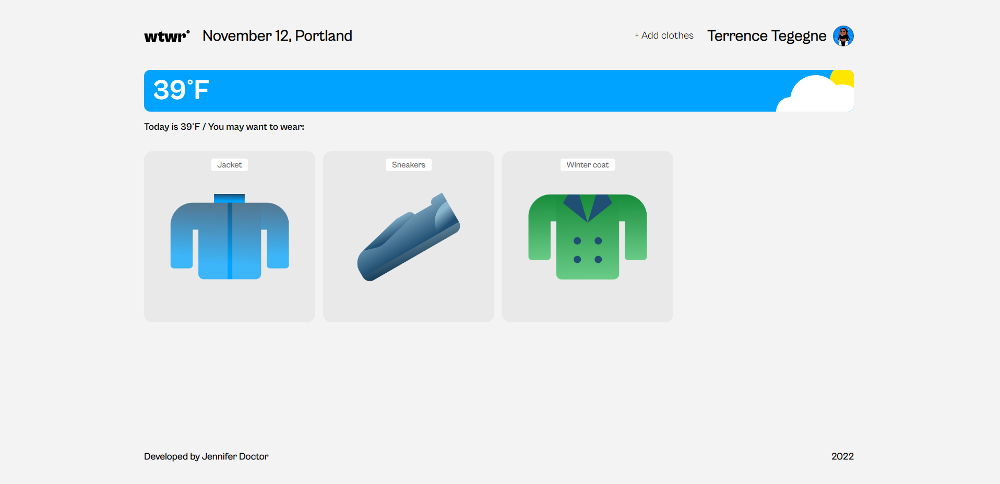

# WTWR (What to Wear?)



Simple weather app created with React to help users decide what to wear based on the current weather.

## Description

Created for Practicum USA Software Engineering Bootcamp. This project is my first experience with React. The app fetchs data from [Open Weather Map's API](https://openweathermap.org/api) according to a set latitude and longitude. This data then dynamicaly styles the app's appearance and filters uploaded clothing based on the weather.

## Getting Started

### Installing

* Clone the repo
* To run the demo, run: ``` npm start ```
* App is hosted at localhost:3000

### Built with

[React.js](https://reactjs.org/)